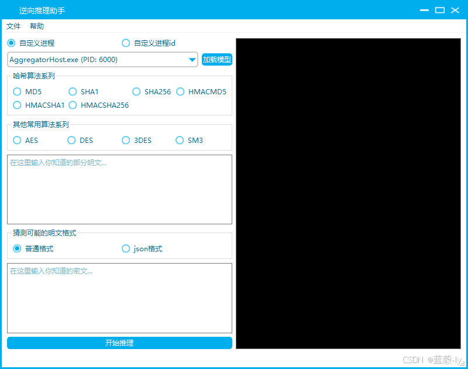
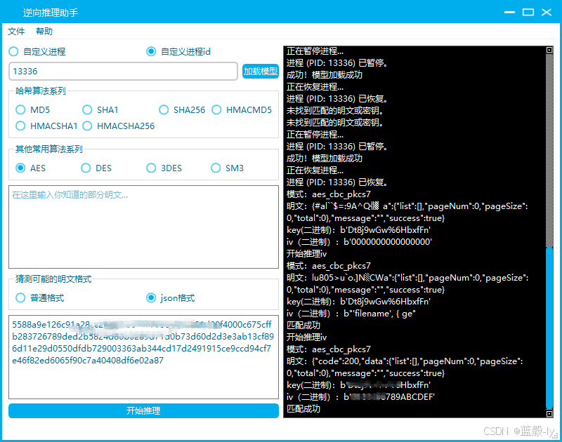
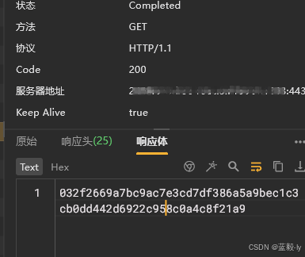
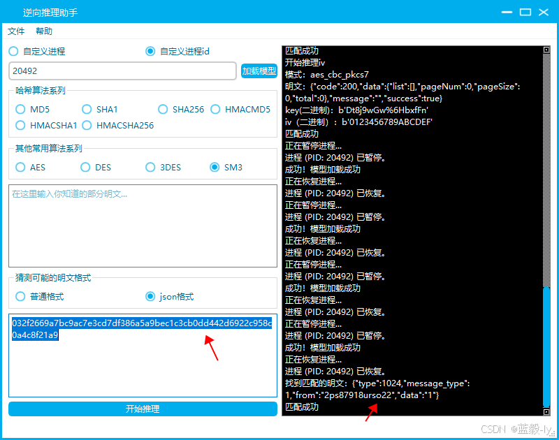

## 项目名称：

**推理算法助手**是一款专为加密分析设计的工具，能够帮助用户快速识别和推测出使用的加密算法类型，并尝试解密出明文。这款工具适用于需要处理不同加密数据的场景，尤其在安全研究、数据恢复和加密分析领域中非常实用。


### 软件截图：


### 最新日志：

1.实现WX小程序。

2.优化匹配算法。


### 用前须知：


- #### 真机功能,需要root（模型比较大，比较消耗内存）使用该功能需要配置。

  ​	进入源代码里面bin目录选择不同cpu架构进入目录执行下面adb 命令，成功后即可使用。

  ​	webview应用的web端模型不是他的包名，经过测试应该是带webview字眼的包名。

  - ```
    
    
    adb push   dumpmm /data/local/tmp
    adb shell
    su
    cd /data/local/tmp
    chmod 777 dumpmm
    
    ```

    

- #### 暂时只适配了win端

- #### 网页的进程在浏览器的任务管理器里面可以看到pid。

- #### b'开头是二进制自己转明文即可。

- #### AEC,DES,3DES,SM4 支持的模式都是cbc、ecb   填充是 zero 和pkcs7  。

- #### 输入的密文自己检查下看着如果是base64或hex软件会自动识别,不是的话会识别成utf-8(某些base64会加上\\/处理自己删除即可)

- #### 注意加载模型时机很重要！最好给请求打上断点并且发包时候加载模型成功率能提高很多，如果需要解密响应体等待数据包完成，再加载模型 。


### 交流群：


=======

>>>>>>> 35a63930d4a49ce20bf003e1c4888b7b51b7d85b


### 使用方法

#### 1. 使用 Nuitka 编译的 .exe 文件 (推理速度较快)

1. 下载并解压缩发布的压缩包 文件。
2. 双击运行 `tlzs.exe`。
3. 在应用程序界面中输入加密文本，选择推测的加密算法类型，点击“开始推理”。
4. 程序将输出识别到的加密算法类型以及解密后的明文。

#### 2. 直接运行 Python 源码

1. 确保系统已安装 Python 3.x 版本。

2. 克隆或下载项目的源码到本地。

3. 进入项目目录，并在终端中运行以下命令：

   ```
   python tlzs.py
   ```

4. GUI 中输入加密文本，选择推测的加密算法类型，点击“开始推理”。

5. 程序将输出识别到的加密算法类型以及解密后的明文。


### 主要功能：

1. **加密算法识别**：通过输入加密文本，工具会自动分析并识别可能使用的加密算法类型，如 DES、AES、RSA 等。
2. **自动解密**：在识别出加密算法后，工具会尝试使用该算法进行解密，并返回解密后的明文结果。
3. **支持多种加密模式**
4. **简单易用的界面**：提供了直观的用户界面，用户只需输入加密文本，选择推测的算法类型，即可快速得到解密结果。

### 适用场景：

- **安全研究**：分析可疑数据包或文件，识别使用的加密算法。

- **数据恢复**：尝试解密遗失密钥的加密文件，恢复重要数据。

- **教育用途**：帮助学习者理解不同加密算法的工作原理和应用场景。

  


### 


# *推**理**算**法**助*手(降维打击) 软件逆向实战


前言
逆向分析，每次从头开始分析参数加密的算法，就会浪费很时间，平时也喜欢写一些小工具来解决问题。日积月累，不知不觉写了一些小工具。本次分享的是推理算法助手，可以快速解决找参数加密，不知道如何加密位置在哪里，还需要分析加密算法类型。那有没有好的解决办法呢?答案是：有。

接下来介绍一款自己开发的软件推理算法助手。实在是降维打击，大大的节约时间，可以快速的出加密算法类型以及加密明文。

一、推理软件介绍
如下图：



写了一些平时自己用的一些常见算法。用起来速度还是很快的。有部分的功能还未来及加入其中。后面有时间在加。如：app逆向算法，小程序，密钥推理，非标准算法等。

二、实战网站【一】
某翻译网站，开始抓包，抓包分析发现请求参数是加密的，经理论分析可能是MD5哈希算法。


把s加密的结果复制到软件中，选择MD5，点击开始推理，没想到不到1秒就出加密的明文结果。该软件若是知道部分加密的值，推理速度会更快。


三、实战网站【二】
某站的结果数据，一开始以为是sha系列的加密算法，经过分析没有找到，换成aes就可以出结果


使用软件看看结果输出的结果



速度没有md5快这个几秒，就出结果。

四、实战网站【三】
抓包分析，猜想是sha系列的加密算法，没有推理出加密的明文，后面换了SM3就把密文推理出来了。




软件推理的结果值




## 

### PyQt5 许可证

本项目中使用了 PyQt5 库，PyQt5 是由 Riverbank Computing 提供的，并受以下许可证约束：

- **GPL (GNU General Public License)**：详见 [PyQt5 官方 GPL 许可证](https://www.riverbankcomputing.com/static/Docs/PyQt5/intro.html#gpl-license)
- **商业许可证**：如果需要商业使用或不希望公开源代码，可以选择购买 [PyQt5 的商业许可证](https://www.riverbankcomputing.com/commercial/license/)

有关详细信息，请参见 PyQt5 的官方文档或许可证文件。

## 免责声明

本软件按“原样”提供，不提供任何形式的明示或暗示的担保，包括但不限于适销性、特定用途的适用性以及非侵权性的保证。在任何情况下，开发者不对因使用本软件而导致的任何损害或损失负责。用户自行承担使用本软件的风险。


